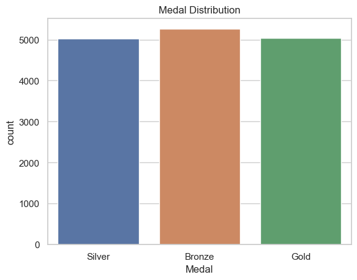
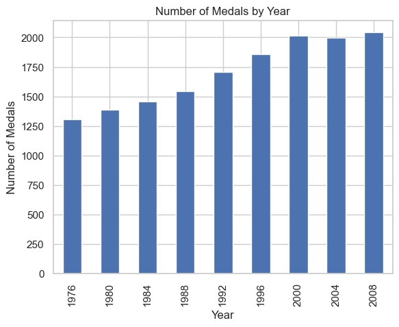
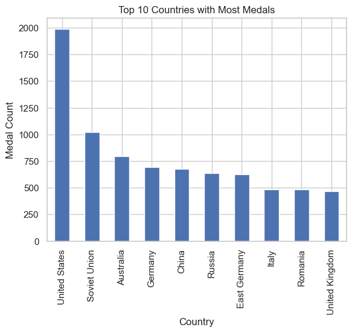

# Olympic Data Analysis

This repository contains a comprehensive analysis of Olympic data. The analysis includes data cleaning, exploratory data analysis (EDA), and visualizations to understand various aspects of the Olympic Games.

## Dataset

The dataset used in this analysis includes information on various Olympic Games, medals, participating countries, and athletes. The dataset provides a rich source of information for analyzing trends and patterns in the Olympics.

## Analysis

The analysis is divided into several sections:

1. **Data Cleaning**:
   - Handling missing values
   - Converting data types

2. **Exploratory Data Analysis (EDA)**:
   - Descriptive statistics
   - Medal distribution analysis
   - Trend analysis of medals over the years
   - Top countries by medal count

3. **Visualizations**:
   - Distribution of medals by type
   - Number of medals by year
   - Top countries in specific years

### Data Cleaning and Preprocessing

- Replaced missing values and converted data types where necessary.
- Ensured data consistency for analysis.

### Exploratory Data Analysis (EDA)

1. **Medal Distribution**:
   - Visualized the distribution of gold, silver, and bronze medals.
   
   - The distribution of medals is generally balanced since an equal number of gold, silver, and bronze medals are available for each event.

2. **Medals Over the Years**:
   - Analyzed the trend of total medals awarded over the years.
   
   - The increase in the total number of medals awarded over the years reflects the addition of new sports and events.

3. **Top Countries by Medal Count**:
   - Identified the top 10 countries by medal count for specific years.
   
   - Top countries have consistently dominated the medal counts. These countries often have substantial funds to invest in the development of new sports, contributing to their success.

### Advanced Analysis

1. **Country-wise Analysis**:
   - Detailed analysis of medal counts by country.
   - Trends in performance over multiple Olympic Games.

## How to Use

1. Clone the repository:
    ```bash
    git clone https://github.com/ibroraheem/olympic-data-analysis.git
    ```
2. Navigate to the repository:
    ```bash
    cd olympic-data-analysis
    ```
3. Install the required libraries:
    ```bash
    pip install -r requirements.txt
    ```
4. Open the Jupyter Notebook:
    ```bash
    jupyter notebook Olympic.ipynb
    ```

## Results

The analysis results are documented in the Jupyter Notebook. Below are some key findings and visualizations:

- The distribution of medals shows a balanced allocation among gold, silver, and bronze, as each event awards one of each.
- There has been a significant increase in the total number of medals awarded over the years, reflecting the growing number of sports and events in the Olympics.
- Top countries, such as the USA, China, and Russia, have consistently dominated the medal counts, partly due to their substantial investment in the development of new sports.

## Conclusion

This analysis provides insights into the historical trends and patterns of the Olympic Games, highlighting key aspects such as medal distribution, top-performing countries, and overall growth in participation.

## Author

- [Ibrahim Abdulraheem](https://github.com/ibroraheem)

## License

This project is licensed under the MIT License - see the [LICENSE](LICENSE) file for details.
